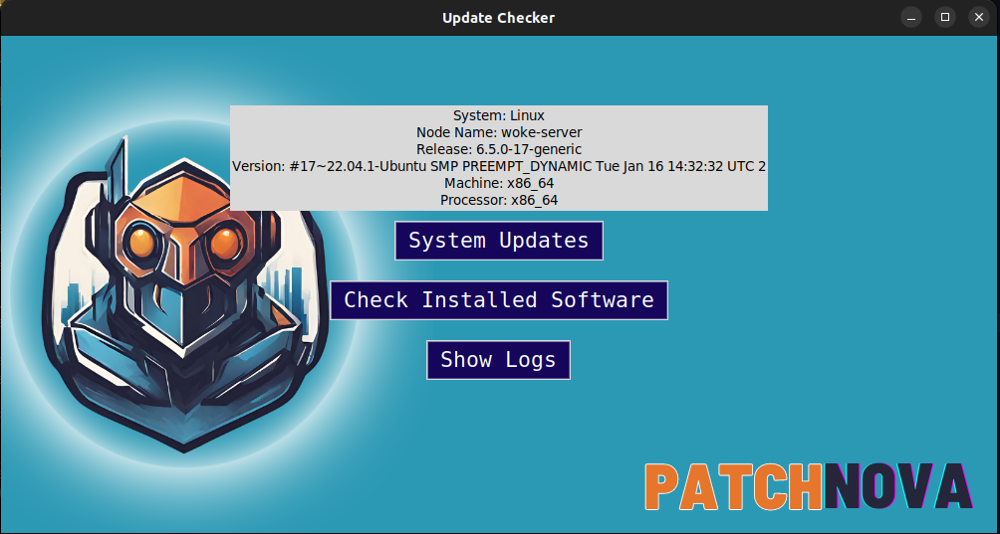

<h1 align="center">PatchNova</h1>

**Revolutionizing Updates:** The Ultimate Ally for DevOps and System Management

<div>
    
    
</div>


<p align="center">
   
</p>

<div align="center">
  
  
  
  
  
  
  
  
</div>


## Table of Contents

1. [Team: The East Code](#team-the-east-code)
2. [Dates](#dates)
3. [Team Members](#team-members)
4. [Project Description](#project-description)

   4.1 [Overview](#overview)

   4.2 [Wireframes](#wireframes)

   4.3 [Key Technologies](#key-technologies)

   4.4 [Wiki Documentation](#wiki-documentation)

5. [Links and Resources](#links-and-resources)
6. [Dependencies](#dependencies)
7. [Installation](#installation)
8. [Testing](#testing)
9. [Usage](#usage)
10. [Future Enhancements](#future-enhancements)
11. [Changelog](#changelog)
12. [Screenshot of Live Demo](#screenshot-of-live-demo)
13. Acknowledgements

## Dates

Project Start Date: 2.2.2024

Presentation Date: 2.9.2024

## Team Members: The East Code

- [x] [Stephanie G. Johnson](https://github.com/StepheeGee)

- [x] [Negin Koushkakinejad](https://github.com/neginkou)

- [x] [Latherio Kidd](https://github.com/LatherioK0818)

- [x] [Ekow Yawson](https://github.com/ekowyawson)

- [x] [Niles Thompson](https://github.com/Niles086)


## Project Description

Revolutionize your update experience with PatchNova – the ultimate ally for DevOps, Systems Engineers, and System Admins. Unleash the power of seamless, automated updates that transcend the mundane. 

PatchNova isn't just an update manager; it's your key to conquering the update realm effortlessly. Tailored for IT professionals handling multiple systems, PatchNova ensures synchronized updates, eliminating the need for manual interventions. With its intuitive interface, automated checks, and robust user consent control, PatchNova empowers you to elevate your systems to new heights. Stay ahead, stay secure, and let PatchNova redefine your update journey!


### 4.1 Overview

<details>
  <summary><strong>User Interface:</strong></summary>
  <ul>
    <li>Ensures a user-friendly experience by collecting information from the user and presenting options clearly.</li>
    <li>Decouples the presentation layer for better maintainability.</li>
  </ul>
</details>

<details>
  <summary><strong>Overall System (Main):</strong></summary>
  <ul>
    <li>Serves as the central manager facilitating interactions between different components.</li>
    <li>Orchestrates the flow of data and operations within the application.</li>
  </ul>
</details>

<details>
  <summary><strong>Local Analysis:</strong></summary>
  <ul>
    <li>Gathers information about the user's system before updates.</li>
    <li>Conducts scans without making changes and provides recommendations based on the analysis.</li>
  </ul>
</details>

<details>
  <summary><strong>Local Changes:</strong></summary>
  <ul>
    <li>Implements the necessary changes to the local system based on the recommendations from the Local Analysis component.</li>
  </ul>
</details>

<details>
  <summary><strong>User System Communicator:</strong></summary>
  <ul>
    <li>Acts as a layer ensuring safe communication and operation with the user's system.</li>
    <li>Manages interactions between the application and the user's system to prevent unintended consequences.</li>
  </ul>
</details>

<details>
  <summary><strong>Web Communicator:</strong></summary>
  <ul>
    <li>Searches for updates and relevant data externally.</li>
    <li>Communicates with external sources to gather information about available updates.</li>
  </ul>
</details>

<details>
  <summary><strong>Logging:</strong></summary>
  <ul>
    <li>Persists information about the changes made during updates.</li>
    <li>Maintains a record of update history, providing transparency and accountability.</li>
  </ul>
</details>

### 4.2 Wireframes


### 4.3 Key Technologies

1. **Beautiful Soup (beautifulsoup4, bs4):**
   - Used for pulling data out of HTML and XML files.
   - Facilitates parsing HTML content, navigating the parse tree, and searching for specific elements.

2. **Tkinter (tkinter):**
   - Used for creating graphical user interfaces.
   - Facilitates the creation of user-friendly interfaces.

3. **Requests (requests):**
   - Used for making HTTP requests.
   - Facilitates communication with web servers to retrieve information.

4. **Rich (rich):**
   - Provides rich formatting for console output.
   - Enhances the visual presentation of information in the console.

5. **Python-Dotenv (python-dotenv):**
   - Loads environment variables from a .env file.
   - Ensures secure and convenient configuration of environment variables.


### 4.4 Wiki Documentation

<table>
    <thead>
        <tr>
            <th>Document</th>
            <th>Description</th>
        </tr>
    </thead>
    <tbody>
        <tr>
            <td><a href="https://github.com/The-East-Code/DevState/wiki/Team-Agreement">Team Agreement</a></td>
            <td>Agreement among team members</td>
        </tr>
        <tr>
            <td><a href="https://docs.google.com/presentation/d/1Jtovw45PjNbt0ceWhgfScA8mgrRe9tlk103KqWnqtJM/edit?usp=sharing">Project Deck</a></td>
            <td>Overview of the project in presentation format</td>
        </tr>
        <tr>
            <td><a href="https://github.com/The-East-Code/DevState/wiki/Pitch-Ideas">Pitch Ideas</a></td>
            <td>Ideas pitched for the project</td>
        </tr>
        <tr>
            <td><a href="https://github.com/The-East-Code/PatchNova/wiki/PatchNova">PatchNova - Selected Idea</a></td>
            <td>Selected idea for the project</td>
        </tr>
        <tr>
            <td><a href="https://www.figma.com/file/944d8MEWVu61UYJFLt5Ksig/PatchNova?type=whiteboard&node-id=0%3A1&t=XQmFbgnWFyCp6M9J-1">Wireframe</a></td>
            <td>Visual representation of the project's wireframe</td>
        </tr>
        <tr>
            <td><a href="https://github.com/The-East-Code/PatchNova/wiki/User-Stories">User Stories</a></td>
            <td>User stories for the project</td>
        </tr>
        <tr>
            <td><a href="https://www.figma.com/file/0axSV8CKdZDOEVoqC6RW4z/Domain-Modeling?type=design&mode=design&t=y8oZsQ7qkDEi0nQI-1">Domain Modeling</a></td>
            <td>Visual representation of the project's domain modeling</td>
        </tr>
        <tr>
            <td><a href="https://github.com/The-East-Code/PatchNova/wiki/Software-Requirements">Software Requirements</a></td>
            <td>Requirements for the software</td>
        </tr>
    </tbody>
</table>

## Links and Resources

[Tkinter Documentation](https://docs.python.org/3/library/tkinter.html)

[Beautiful Soup Documentation](https://www.crummy.com/software/BeautifulSoup/bs4/doc/)

## Dependencies

See [Requirements.txt](requirements.txt)

<div align="center">
    
    <br><br>
</div>

## Installation


To run PatchNova, follow these steps:

1. Clone the repository to your local machine:

   ```bash
   git clone https://github.com/The-East-Code/PatchNova.git
   ```

2. Navigate to the project directory:

   ```bash
   cd PatchNova
   ```

3. Install the required dependencies using pip:

   ```bash
   pip install -r requirements.txt
   ```

## Usage

To use PatchNova, execute the following command:

```bash
python3 patch_nova.py
```

This will launch the PatchNova application, providing a user-friendly interface for checking system updates, installed software, and viewing logs.

## Features:

1. **Check System Updates:**
   - Click on the "System Updates" button to initiate a check for updates on your operating system.
   - Follow on-screen prompts to confirm the update installation.

2. **Check Installed Software:**
   - Click on the "Check Installed Software" button to view a list of installed programs.
   - The list will be displayed in a pop-up window, organized by program name and version.

3. **Show Logs:**
   - Click on the "Show Logs" button to view logs containing update history and error information.
   - Logs are presented in a separate window with tabs for "Update History" and "Error Log."

4. **Custom Dialogs:**
   - Custom dialogs are utilized for user interactions, providing clear messages and options.

5. **Logging:**
   - PatchNova maintains logs in files ("update_history.log" and "error_log.log") for transparency and error tracking.

**Note:** Ensure that you have the necessary permissions to install system updates, especially when running on Linux, and that you have the appropriate package manager installed.


## Testing

### `test_update_check.py`

1. **Setup Logging:**
    - Test the `setup_logging` method to ensure that the logger has no handlers after calling the method.

    ```python
    def test_setup_logging(app):
        app.setup_logging()
        app.logger.handlers.clear()
        assert len(app.logger.handlers) == 0
    ```

2. **Get Hardware Information:**
    - Test the `get_hardware_info` method to verify that the hardware information label is updated correctly.

    ```python
    @patch('platform.uname') 
    def test_get_hardware_info(mock_uname, app):
        mock_uname.return_value = MagicMock(system='TestSystem', node='TestNode', release='TestRelease', version='TestVersion', machine='TestMachine', processor='TestProcessor')
        app.get_hardware_info()
        expected_text = "System: TestSystem\nNode Name: TestNode\nRelease: TestRelease\nVersion: TestVersion\nMachine: TestMachine\nProcessor: TestProcessor"
        assert app.hardware_info_label.cget('text') == expected_text
    ```

3. **Check Updates:**
    - Test the `check_updates` method to ensure that user consent is handled properly and the correct update process is triggered.

    ```python
    @patch('subprocess.run')
    @patch('platform.system')
    @patch('tkinter.messagebox.askyesno')
    def test_check_updates(mock_askyesno, mock_system, mock_run, app):
        mock_askyesno.return_value = True
        mock_system.return_value = 'Linux'
        mock_run.return_value = MagicMock(stdout=b"Mock output that distro.id() would expect")
        app.check_updates()
    ```

4. **User Consent Handling:**
    - Test the `get_user_consent` method to ensure that it returns `True` when the user consents and `False` otherwise.

    ```python
    def test_user_consent_handling(app):
        with patch('tkinter.messagebox.askyesno', return_value=True) as mock_askyesno:
            assert app.get_user_consent() is True
        with patch('tkinter.messagebox.askyesno', return_value=False) as mock_askyesno:
            assert app.get_user_consent() is False
    ```

5. **Display Installed Software (Windows):**
    - Test the `display_installed_software_windows` method to ensure it works only on Windows.

    ```python
    @pytest.mark.skipif(platform.system() != "Windows", reason="This test is only relevant on Windows.")
    @patch('platform.system', return_value="Windows")
    @patch('subprocess.check_output')
    @patch('patchnova.patch_nova.winreg', create=True)  # Mock winreg for non-Windows platforms
    def test_display_installed_software_windows(mock_winreg, mock_subprocess, mock_system, app):
        mock_subprocess.return_value = b'Windows mock output'
        app.check_software_updates()
    ```

6. **Show Logs:**
    - Test the `show_logs` method to ensure that the log dialog is created with the correct attributes.

    ```python
    def test_show_logs(app):
        with patch('builtins.open', new_callable=mock_open, read_data="Test log content"), \
             patch('tkinter.Toplevel') as mock_toplevel, \
             patch('tkinter.Text') as mock_text:
            app.show_logs()
    ```

7. **Create Custom Dialog:**
    - Test the `create_custom_dialog` method to ensure that it creates a custom dialog with the correct title and message.

    ```python
    def test_create_custom_dialog(app):
        title = "Test Title"
        message = "Test message"
        with patch.object(tk.Toplevel, "title") as mock_title, \
             patch.object(tk.Toplevel, "configure") as mock_configure, \
             patch('tkinter.Label') as mock_label, \
             patch('tkinter.Button') as mock_button:
            app.create_custom_dialog(title, message)
            mock_title.assert_any_call(title)
    ```

## Future Enhancements

1. **Update Rollback:**
   - Implement the ability to undo the installation of updates, providing users with a safety net in case of unexpected issues.

2. **Network IP Scan:**
   - Introduce a feature to scan the local network for other devices, providing users with insights into the connected devices and their update status.

3. **Remote Deployment:**
   - Enable the capability to update other computers on the network remotely, streamlining the update process for multiple devices.

4. **Driver Updates:**
   - Integrate functionality to check and update system drivers, ensuring the latest compatibility and performance improvements.

5. **Update All Software:**
   - Extend the application to handle updates for all installed software on the user's computer, offering a comprehensive solution for software maintenance.

6. **Update Modules:**
   - Implement a module updating feature, ensuring that all components and dependencies of the application stay current.

These future enhancements aim to broaden the capabilities of PatchNova, providing users with more control and comprehensive coverage in managing updates across their computing environment.


## Changelog

### Version 1.0.0 (02/04/2024)

#### Added

- **[User Interface]** Implemented a user-friendly interface for collecting information and presenting options clearly.
- **[Overall System]** Developed the main system to serve as a central manager, facilitating interactions between different components.
- **[Local Analysis]** Added functionality to gather information about the user's system before updates.
- **[Local Changes]** Implemented the ability to make necessary changes to the local system based on recommendations from the Local Analysis component.
- **[User System Communicator]** Added a layer to ensure safe communication and operation with the user's system, preventing unintended consequences.
- **[Web Communicator]** Implemented a module to search for updates and relevant data externally, communicating with external sources.
- **[Logging]** Added logging functionality to persist information about changes made during updates, maintaining a record of update history for transparency and accountability.

#### Changed

- **[Key Technologies]** Updated the key technologies, including Beautiful Soup, Tkinter, Requests, Rich, and Python-Dotenv, to their specified versions.

#### Removed

- **[Obsolete Module]** Removed an obsolete module that was not relevant to the current system.

#### Fixed

- **[Bug Fix]** Resolved a bug related to system updates on Windows, ensuring proper execution.

### Version 1.0.1 (02/05/2024)

#### Added

- **[Feature]** Added a new feature for displaying installed software on Windows systems.

#### Changed

- **[Dependency Upgrade]** Upgraded the dependency versions to ensure compatibility and security.

### Version 1.0.2 (02/06/2024)

#### Added

- **[Feature]** Implemented a custom dialog for displaying messages to users.

#### Changed

- **[UI Enhancement]** Improved the UI with larger buttons and increased padding for better user interaction.

### Version 1.0.3 (02/07/2024)

#### Added

- **[Feature]** Added a feature for checking and displaying system logs.

#### Removed

- **[Redundant Code]** Removed redundant code that was not contributing to the functionality.


## Screenshot of Live Demo


Actual size: 1000x500



<div align="center">

##  &nbsp; Acknowledgements &nbsp; </div>

We would like to express our gratitude to the open-source community for providing invaluable resources and inspiration throughout the development of PatchNova. Special thanks to the contributors of Beautiful Soup, Tkinter, Requests, Rich, and Python-Dotenv for their exceptional work.

<div align="center">
	<br>
		
	<br>
</div>

